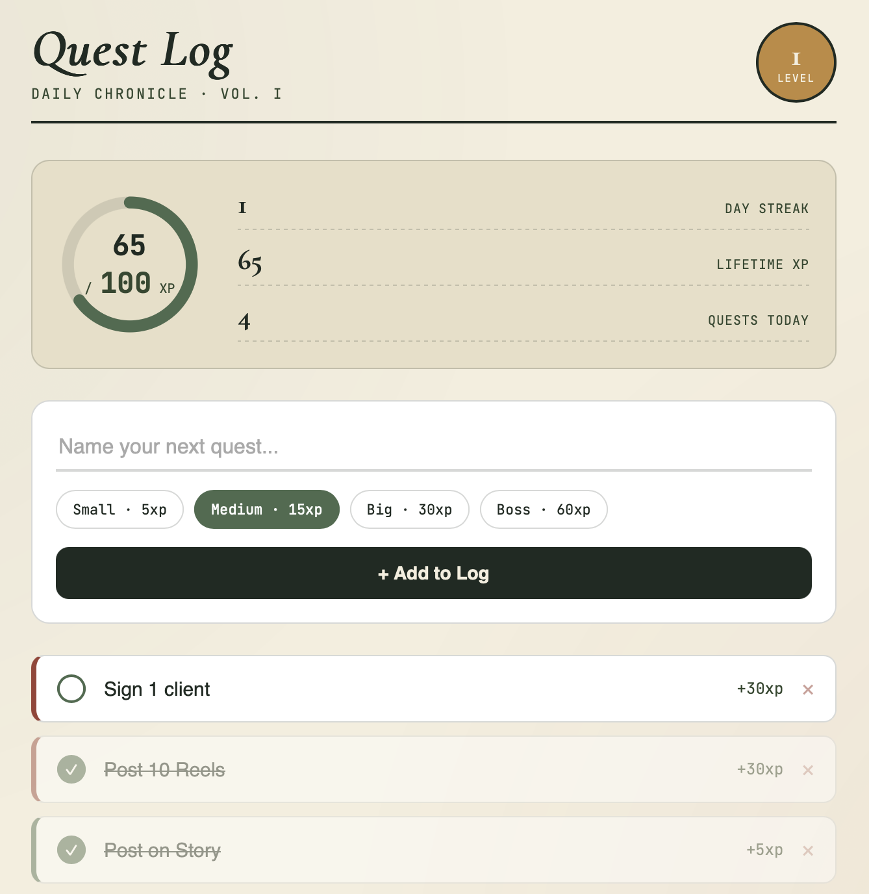

# Quest Log

A gamified daily task tracker that turns your to-do list into an XP system — small wins earn points, points level you up, and a streak counter keeps you honest day to day.

**[Live demo →](#)** *(add your GitHub Pages link here once deployed)*



## Why I built this

I'm a marketer and founder, not an engineer — but I use Claude to build small tools that solve real problems in how I run my day and my business. This one started as a simple question: *what if my to-do list actually felt rewarding to use?*

Quest Log reframes tasks as "quests" with tiered point values (small, medium, big, boss), tracks a daily streak, and levels you up as XP accumulates. No account, no backend, no tracking — everything lives in your browser.

## Features

- **XP & leveling** — tasks are worth different points based on effort (small = 5xp, boss = 60xp), and you level up automatically as XP accumulates
- **Streak tracking** — completing at least one quest keeps your streak alive; missing a full day resets it
- **Daily rollover** — completed quests clear at midnight, unfinished ones carry over so nothing gets lost
- **Circular progress ring** — a visual read on how close you are to the next level
- **Zero setup** — pure HTML/CSS/JS, no build step, no dependencies, works offline

## Tech

HTML, CSS, and vanilla JavaScript. Quests you add manually live in your browser's `localStorage`. Quests added by an external automation (like a daily Claude-generated task list) sync in read-only from a Supabase table each time you load the page.

- `index.html` — structure
- `style.css` — styling (parchment/moss color system, Cormorant Garamond + Work Sans + JetBrains Mono)
- `script.js` — all the logic: XP math, leveling, streaks, daily rollover, and the Supabase read

### Auto-populating quests from an automation

The site connects to Supabase using a **publishable key that can only read data** — it has no permission to insert, update, or delete, so it's safe to have visible in the client-side code.

To feed it daily tasks automatically, set up a scheduled automation (e.g. a Cowork task or Make.com scenario) that inserts rows into the `quest_log_quests` table using your Supabase **service role key** (kept private, server-side only) with:

```sql
insert into quest_log_quests (name, tier, xp, source, quest_date)
values ('Send outreach batch', 'medium', 15, 'automation', current_date);
```

Any row with `source = 'automation'` and today's date will show up in the app automatically, tagged with a small "auto" label so you can tell it apart from what you added by hand.

**Note:** completing or deleting a quest only updates your local browser — it doesn't write back to Supabase. Multi-device sync of *completed* state isn't built yet; this only syncs new quests in, one direction.

## Demo mode vs. live mode

The public link above always shows a **generic demo** with sample quests — it never connects to Supabase or reveals any real task data, even to you, by default. Anyone who visits it sees the demo.

**Live mode** (pulling in your real automated tasks) only turns on for you, and only on the device where you activate it:

1. Visit the live link with `?sync=on` added once, e.g. `https://YOUR-USERNAME.github.io/quest-log/?sync=on`, on your own device
2. This sets a flag stored locally in that browser and immediately cleans the URL, so the link never looks different if you screenshot or share it
3. From then on, that browser fetches your real automated tasks; every other visitor still only sees the demo

To turn live mode off on a device, open the browser's dev tools console and run `localStorage.removeItem('questlog_live_sync')`.

## Running it locally

No build tools needed. Clone the repo and open `index.html` in a browser, or serve it locally:

```bash
git clone https://github.com/YOUR-USERNAME/quest-log.git
cd quest-log
python3 -m http.server 8000
# then visit http://localhost:8000
```

## Deploying

This is a static site, so GitHub Pages works out of the box:

1. Push this repo to GitHub
2. Go to **Settings → Pages**
3. Set the source to the `main` branch, root folder
4. Your live link will be `https://YOUR-USERNAME.github.io/quest-log/`

## About me

I'm Krista — a marketer and founder building [Locale](https://app.localecampus.com), a campus creator marketplace, and writing about systems, automation, and nervous-system-friendly productivity at [@remotelykrista](https://instagram.com/remotelykrista). More of my work: [kristahook.social](https://kristahook.social)

## License

MIT — feel free to fork this and make it your own.
